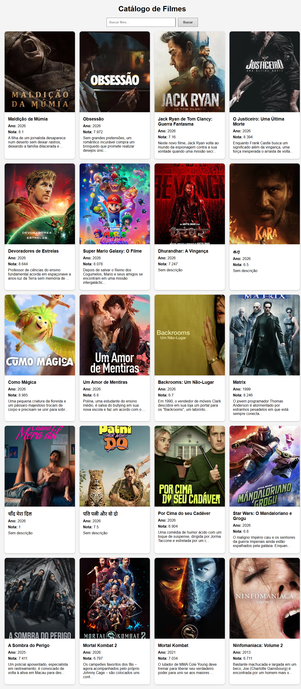

# Trabalho Prático - Semana 12

Nesta atividade, vamos trabalhar com uma API de mercado para montar uma interface de visualização de filmes. Para isso, vamos utilizar a [The Movie DB API](https://developer.themoviedb.org/docs/getting-started). A página resultante deve listar os resultados de uma requisição HTTP no formato de cards e deve incluir uma funcionalidade de pesquisa ou filtro. 

# Atividade Prática - Fetch API com TMDB

Nome: Heitor Henrique Gonçalves 

Matrícula: 924375

## Endpoint utilizado

/movie/popular

## Funcionalidade implementada

Pesquisa por nome de filme utilizando o endpoint:

/search/movie

## Fluxo da aplicação

A aplicação realiza uma requisição assíncrona para a API do TMDB utilizando Fetch API e async/await.

Os dados retornados em JSON são tratados e convertidos em cards contendo poster, título, ano de lançamento, nota média e sinopse.

Os cards são renderizados dinamicamente no DOM e atualizados quando o usuário realiza uma pesquisa.

## Prints

### Lista inicial de filmes

### Resultado da pesquisa

